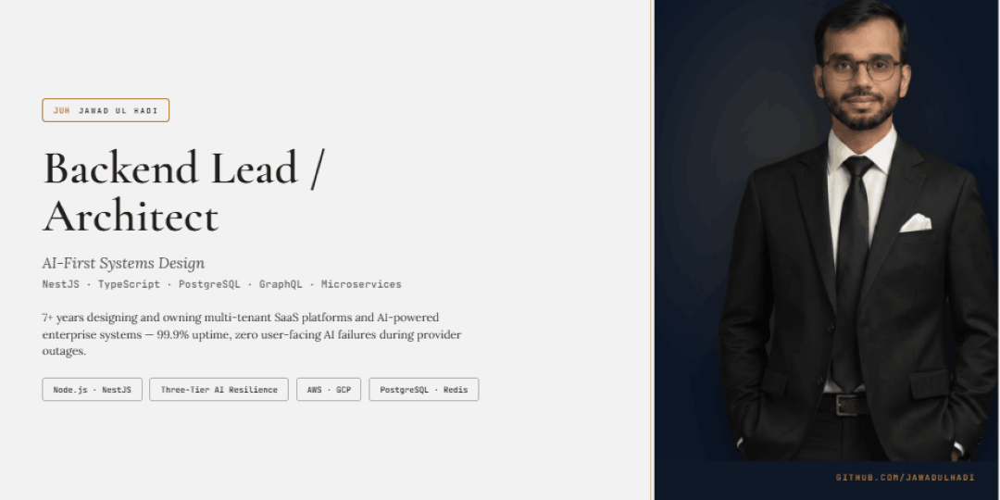

<!-- ==========================================================================
     GitHub Profile README  ·  github.com/JawadulHadi/JawadulHadi
     Source of truth: Jawad_Ul_Hadi_Resume.docx  ·  Keep title/metrics in sync.
     Banner files: ./banners/repo-banner-dark.png and ./banners/repo-banner-light.png
========================================================================== -->

  <picture>
    <source media="(prefers-color-scheme: dark)" srcset="./banners/repo-banner-dark.png">
    <source media="(prefers-color-scheme: light)" srcset="./banners/repo-banner-light.png">
    
  </picture>

<h1 align="center">Jawad Ul Hadi</h1>

<strong>Senior Backend Engineer</strong> — NestJS / Node.js — AI/LLM Integration

  <a href="https://www.linkedin.com/in/jawad-ul-hadi">LinkedIn</a>
   • 
  <a href="https://jawadulhadi-portfolio.vercel.app/">Portfolio</a>
   • 
  <a href="https://orcid.org/0009-0007-1317-4615">ORCID</a>
   • 
  <a href="mailto:jawadulhadicc@gmail.com">Email</a>

<i>Open to remote, hybrid, or relocation — US / EU / APAC overlap</i>

<i>Full-time or contract engagements</i>

---

## About

I build backend systems that scale, AI features that ship, and integrations that connect. With over 7 years of software engineering experience, I specialize in serverless architectures, high-performance databases, and multi-tenant SaaS platforms with strict per-tenant isolation, asynchronous processing, and AI integrations across multiple agents (OpenAI, Gemini, Anthropic) with deterministic rule-based fallbacks.

I translate business outcomes into technical implementations that drive growth.

---

## Technology Stack

### Languages & Frameworks

| Primary | Secondary | Utilities |
| --------- | ----------- | ----------- |
| TypeScript | Python | JavaScript |
| Node.js | Django / DRF | FastAPI |
| NestJS | | |

### Data & Search Solutions

| Relational | NoSQL | Search & Cache |
| ----------- | -------- | ----------- |
| PostgreSQL | MongoDB / Mongoose | Redis |
| MySQL | | MeiliSearch |

### AI & Machine Learning

| Core Platform | Capabilities | Integration |
| --------------- | -------------- | ------------- |
| OpenAI SDK | Structured Output | RAG Systems |
| Google Gemini | Multi-modal Analysis | Rule-based Fallbacks |
| Anthropic Claude | Document Processing | Vision APIs |

### Infrastructure & DevOps

| Async Processing | Cloud Platforms | Containerization | CI/CD |
| ----------------- | ----------------- | ----------------- | ------- |
| BullMQ | Google Cloud Platform | Docker | GitHub Actions |
| Redis Queues | AWS (Lambda, API Gateway) | | |
| Webhooks | | | |
| n8n Automation | | | |

### Integrations & Security

| Payments & Communication | Data & Storage | Authentication | Architecture |
| -------------------------- | ----------------- | ----------------- | -------------- |
| Stripe | GCS | JWT / OAuth 2.0 | RBAC |
| Twilio | Microsoft Graph | Tenant Isolation | API Design |
| Postal SMTP | | Session Management | Multi-tenant Systems |

---

## Featured Projects

**Qeloma Suite** — Seven production-grade capability demos showcasing enterprise AI integrations. Enterprise work (Talentnix ATS, APAC HRMS, iAgility, AgileiBrains) is in private, IP-protected repos under NDA. Architecture diagrams, live walkthroughs, and references available upon request.

| Project | Capability |
| --------- | ----------- |
| [Qeloma Verdict](https://github.com/Qeloma/qeloma-verdict) | Tamper-evident decision engine with cryptographic audit trails for EU AI Act compliance |
| [Qeloma OCR](https://github.com/Qeloma/qeloma-ocr) | Client-side OCR with per-word confidence scoring (Tesseract.js / Gemini Vision / hybrid) |
| [Qeloma Lens Studio](https://github.com/Qeloma/qeloma_lens_studio) | AI-powered document analysis — summarize, extract, compare (Gemini + rule-based fallbacks) |
| [Qeloma Voice Studio](https://github.com/Qeloma/qeloma_voice_studio) | Real-time voice analyst grounded in custom document corpus (Gemini Live API) |
| [Qeloma Shift](https://github.com/Qeloma/qeloma_shift) | Semantic change-intelligence engine — meaning-level diffing and materiality scoring |
| [Qeloma Cover Studio](https://github.com/Qeloma/qeloma-cover-studio) | Browser-based LinkedIn banner designer with optional Gemini-assisted generation |
| [Room Booking](https://github.com/Qeloma/qeloma_room_booking_app) | Resource-management platform — meeting room scheduling and booking automation |

---

## 🎓 Professional Certifications & Credentials

**26+ Certifications** across cloud platforms, AI/ML, and enterprise systems:

| Provider | Certifications |
| ---------- | --- |
| **Google Cloud** | Generative AI Fundamentals, Cloud Computing Foundations |
| **IBM SkillsBuild** | AI Fundamentals, Cloud Computing, Data Analytics, Cybersecurity Fundamentals, Web Development, IT Fundamentals, Professional Skills |
| **LinkedIn Learning** | AI Orchestration (LangChain), Chatbot Development with OpenAI, Agentic AI Architecture, Advanced Python, Database Design |
| **Specialized** | Certified Django Developer (e-smartdata.org, 2025) |

➜ **[View Full Certification Gallery & Verification Links](./certifications.md)**

---

## 📋 Disclosure & Compliance

### **GitHub Public Profile Terms**

- This profile accurately reflects professional qualifications, experience, and public contributions
- Enterprise/client work maintained under NDA in private repositories (available upon request with proper authorization)
- All certifications verified through official issuing platforms: Google Cloud, IBM, LinkedIn Learning, Coursera, Credly, e-smartdata.org
- Portfolio projects demonstrate real-world capabilities in backend systems, AI integrations, and full-stack development

### **Data & Privacy**

- No sensitive personal or client information is shared publicly
- Contact information provided is official professional channels only
- For opportunities or references: [LinkedIn](https://www.linkedin.com/in/jawad-ul-hadi) or [Email](mailto:jawadulhadicc@gmail.com)

### **Attribution**

- GitHub Statistics powered by [github-readme-stats](https://github.com/anuraghazra/github-readme-stats)
- Banner assets custom-designed and version-controlled
- Repository maintained in compliance with GitHub Community Guidelines

---

  Most enterprise work is maintained under NDA across private repositories. The public portfolio represents capability demonstrations and open-source contributions.

