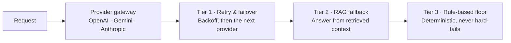

  

**Seven years building Backend Lead Engineer, most of it on multi-tenant SaaS and AI-powered enterprise systems. I work in Node.js,
NestJS, and TypeScript over PostgreSQL, MySQL, MongoDB, and Redis, with Python and FastAPI where those fit better,
and I own architecture from database schema through deployment. Recent work has been in production AI: Anthropic
models, MCP servers, provider abstraction, RAG pipelines, and the resilience patterns that keep them from failing loudly.**

### Featured · Designing for AI failure

One abstraction sits in front of OpenAI, Gemini and Anthropic. When a provider degrades, requests step down through three tiers instead of surfacing an error. It became the team's standard failure-handling architecture and cut AI integration complexity by 60%.

```mermaid
flowchart LR
  R[Request] --> G[Provider gateway<br/>OpenAI · Gemini · Anthropic]
  G --> T1[Tier 1 · Retry & failover<br/>Backoff, then the next provider]
  T1 --> T2[Tier 2 · RAG fallback<br/>Answer from retrieved context]
  T2 --> T3[Tier 3 · Rule-based floor<br/>Deterministic, never hard-fails]
```

[Read the full case study →](https://juh-bukhari.vercel.app/case-study)

| Role                     | System                               | Stack                                                          |
| ------------------------ | ------------------------------------ | -------------------------------------------------------------- |
| Backend Lead & Architect | Multi-tenant AI recruitment ATS      | NestJS · MongoDB · Gemini · MeiliSearch · BullMQ · Postal SMTP |
| Backend Engineer         | APAC HRMS & payroll core             | NestJS · MySQL · PostgreSQL · GCS                              |
| Backend Engineer         | Enterprise agile collaboration suite | NestJS · GraphQL · WebSocket · PostgreSQL · Docker             |
| Software Engineer        | Serverless gateway & CRM layer       | AWS Lambda · API Gateway · FastAPI · Django REST               |

## Projects & open source

Personal builds, public and verifiable.

**Flagship · Chrome extension pack.** Ten Manifest V3 extensions for developer and AI workflows: context extraction for agents, an API interceptor and mock sandbox, a schema and JWT decoder, a prompt workbench with diffing, token and cost estimates, a document scraper, a cross-LLM model switcher, a webhook relay, session isolation and a browser workflow recorder.
`Chrome Extension API · TypeScript · Gemini API · WebSockets · IndexedDB`

**Infrastructure · Idempotent queue spine.** A BullMQ and Redis backbone for OCR extraction, batch email and multi-tenant webhook dispatch, with HMAC signature verification, dead-letter queues and exactly-once processing.
`BullMQ · Redis · NestJS · HMAC`

### The Qeloma suite

| Project             | What it does                                                                                                                       | Link                                                          |
| ------------------- | ---------------------------------------------------------------------------------------------------------------------------------- | ------------------------------------------------------------- |
| Verdict             | Tamper-evident decision engine that issues reasoning receipts with cryptographic audit trails, built for EU AI Act record-keeping. | [Live ↗](https://qeloma-verdict.vercel.app/)                  |
| OCR                 | Client-side OCR with per-word confidence scores from Tesseract.js, Gemini vision or a hybrid of both.                              | [Live ↗](https://qeloma-ocr.vercel.app/)                      |
| Lens Studio         | Summarise, extract and compare across PDFs, DOCX and images, powered by Gemini with rule-based fallbacks.                          | [Live ↗](https://qelomalens.vercel.app/)                      |
| Voice Studio        | Real-time voice analyst that answers from your own documents through the Gemini Live API.                                          | [Live ↗](https://qeloma-voice.vercel.app/)                    |
| Shift               | Semantic diffing for contracts and configs that ranks changes by severity and explains business impact.                            | [Live ↗](https://qeloma-shift.vercel.app/)                    |
| Cover Studio        | Browser-based LinkedIn banner studio that composes on-brand vector cover art from a short prompt.                                  | [Source ↗](https://github.com/Qeloma/qeloma-cover-studio)     |
| Meetings Rooms Engine  | Scheduling backplane that resolves overlapping booking requests with conflict-safe reservation locking.                         | [Source ↗](https://github.com/Qeloma/qeloma_room_booking_app) |

## Selected work

> Client systems are under NDA. Architecture is described without business data or endpoints.

## Stack

| Area         | Tools                                                                                             |
| ------------ | ------------------------------------------------------------------------------------------------- |
| Architecture | Multi-tenant SaaS, microservices, event-driven design, GraphQL API design, reliability trade-offs |
| Backend      | Node.js, NestJS, TypeScript, Python, FastAPI, Django, PostgreSQL, MongoDB, MySQL, Redis           |
| AI systems   | RAG pipelines, MCP servers, OpenAI, Gemini and Anthropic integration, Claude Code, Copilot        |
| Delivery     | GitHub Actions, Jest, OAuth 2.0 / JWT, AWS, GCP, Docker, Kubernetes, BullMQ                       |

## Services

|     | Service                  | Scope                                                                                                      |
| --- | ------------------------ | ---------------------------------------------------------------------------------------------------------- |
| 01  | Backend architecture     | Multi-tenant SaaS design with tenant isolation, schema strategy and REST or GraphQL API contracts.         |
| 02  | AI platform & resilience | Provider-agnostic LLM layers, RAG pipelines and fallback ladders that keep AI features up through outages. |
| 03  | Performance & scale      | Query and index work, search, and queue-based workloads that keep APIs sub-second under load.              |
| 04  | Technical leadership     | Leading backend teams through design review, code review and mentoring.                                    |

**Education:** B.S. Computer Science, Government College University, Faisalabad, 2018

**Certifications** from IBM, Microsoft, Google, Anthropic, Coursera, and LinkedIn Learning in AI/LLM, cloud infrastructure, and backend engineering.
[Certification's Page](./CERTIFICATIONS.md)

## Contact

Open to Backend Lead, Solutions Architecture and AI Platform roles, remote, hybrid or relocating.

   <a
                          href="https://gravatar.com/juhbukhari"
                          target="_blank"
                          rel="noopener noreferrer"
                          style="
                            color: #ffffff;
                            font-family:
                              -apple-system, BlinkMacSystemFont,
                              &quot;Segoe UI&quot;, Roboto, sans-serif;
                            font-size: 11.5px;
                            font-weight: 600;
                            text-decoration: none;
                            white-space: nowrap;
                          "
                          >🌐&nbsp;Profile</a
                        >
       <a
                          href="https://maps.google.com/?q=Islamabad,Pakistan"
                          target="_blank"
                          rel="noopener noreferrer"
                          style="
                            color: #ffffff;
                            font-family:
                              -apple-system, BlinkMacSystemFont,
                              &quot;Segoe UI&quot;, Roboto, sans-serif;
                            font-size: 11.5px;
                            font-weight: 600;
                            text-decoration: none;
                            white-space: nowrap;
                          "
                          >📍&nbsp;Islamabad, PK</a
                        >

