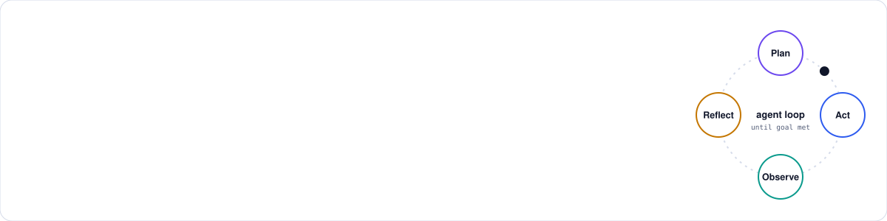
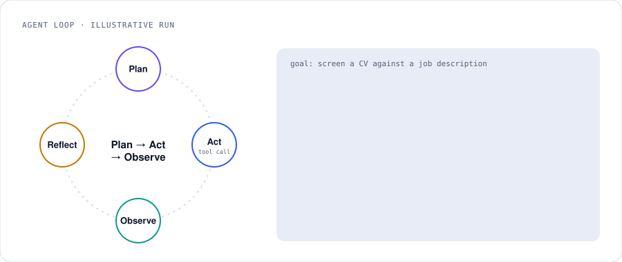
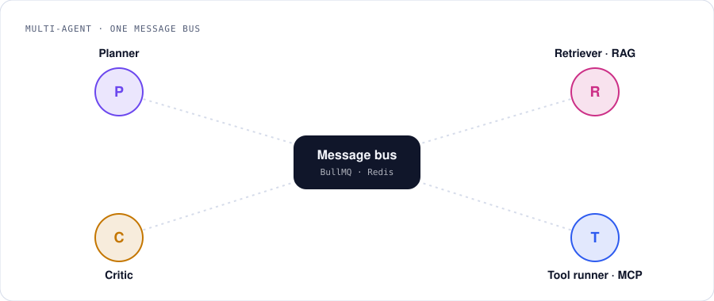
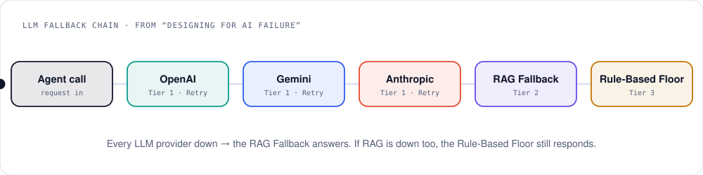

<picture>
  <source media="(prefers-color-scheme: dark)" srcset="./assets/header-dark.svg">
  
</picture>

### Backend Lead Engineer / Architect

NestJS · TypeScript · PostgreSQL · GraphQL · BullMQ · Redis · RAG · LLM

8+ years on production backends. I own multi-tenant SaaS architecture from database schema to deployment, with a recent focus on production AI: a provider-agnostic LLM layer, RAG, and failure containment. Backend Lead Engineer at MicroAgility Services, Jan 2024 – Present. Based in Islamabad (UTC+5), with working hours aligned to EST/PST for US and Canada remote teams.

> [!IMPORTANT]
> **Case study · [Designing for AI Failure](https://juh-bukhari.vercel.app/case-study)**
> How the Talentnix AI gateway kept answering through live LLM outages: Retry across OpenAI, Gemini and Anthropic → RAG Fallback → Rule-Based Floor. Result: **zero AI failures during live LLM outages**.

### Impact, in numbers

| Result | System |
| --- | --- |
| Dashboard load **from 12s to under 2s (83%)** | PostgreSQL and MongoDB query tuning, new indexes, MeiliSearch rollout |
| **Cut AI integration complexity by 60%** | Talentnix AI gateway: OpenAI, Gemini and Anthropic behind one routing layer with automatic failover |
| **Zero AI failures during live LLM outages** | Retry → RAG Fallback → Rule-Based Floor |
| **No cross-tenant data exposure incidents to date** | Tenant isolation across REST and GraphQL APIs with OAuth 2.0/JWT |
| **APIs under a second while thousands of async jobs run concurrently** | Event-driven BullMQ and Redis job pipeline |
| Mentoring **three associate backend developers** | Learning & Development programme |

### Agentic loops I build

**One agent: plan, act, observe, reflect.** Each pass ends in Reflect: loop again with what was learned, or stop and respond. Illustrative run from the internal ATS (Claude Code + Gemini 2.5 Flash).

<picture>
  <source media="(prefers-color-scheme: dark)" srcset="./assets/agent-loop-dark.svg">
  
</picture>

**A team of agents on one bus.** Planner, Retriever (RAG), Tool runner (MCP) and Critic exchange tasks through BullMQ and Redis until the Critic approves.

<picture>
  <source media="(prefers-color-scheme: dark)" srcset="./assets/agent-swarm-dark.svg">
  
</picture>

**The fallback chain behind every agent call.** Two retries per provider, a circuit breaker opens, the call moves on. With every LLM provider down, the RAG Fallback answers; the Rule-Based Floor answers last.

<picture>
  <source media="(prefers-color-scheme: dark)" srcset="./assets/fallback-chain-dark.svg">
  
</picture>

### Public projects

Personal builds, public and verifiable. Client systems are under NDA, so they appear only as architecture.

| Project | What it does | Link |
| --- | --- | --- |
| Omni.io | Multi-tenant RAG support engine with a three-tier resilience ladder, Postgres row-level-security isolation, an embeddable widget and an MCP server. | [Source](https://github.com/Qeloma/omni-io) |
| Verdict | Tamper-evident decision engine that issues hash-chained, signed reasoning receipts for EU AI Act record-keeping. | [Live ↗](https://qeloma-verdict.vercel.app/) |
| Lens Studio | Summarise, extract and compare across PDFs, DOCX and images on Gemini, with deterministic fallbacks. | [Live ↗](https://qelomalens.vercel.app/) |
| Voice Studio | Real-time voice analyst on the Gemini Live API that answers from your own documents. | [Live ↗](https://qeloma-voice.vercel.app/) |
| Shift | Semantic diffing for contracts and configs that ranks changes by materiality and explains business impact. | [Live ↗](https://qeloma-shift.vercel.app/) |
| Scanwise | Turns scans, PDFs and Office files into one cited summary and a source-grounded chat, with on-device OCR. | [Source](https://github.com/JawadulHadi/scanwise) |

### Stack

- **Backend:** NestJS · Node.js · TypeScript · Express.js · Python · FastAPI · Django REST Framework
- **Data:** PostgreSQL · MySQL · MongoDB · Redis · BullMQ · MeiliSearch
- **AI:** LLM integration (OpenAI, Gemini, Anthropic) · RAG pipelines · MCP servers · AI agent workflows · Claude Code · GitHub Copilot
- **Architecture:** Multi-tenant SaaS · microservices · event-driven architecture · REST and GraphQL API design
- **Cloud and delivery:** AWS (Lambda, API Gateway) · GCP · OpenStack · Docker · Kubernetes · GitHub Actions · Jest · OAuth 2.0/JWT

### Experience

- **Backend Lead Engineer**, MicroAgility Services (Pvt) Ltd. · Jan 2024 – Present · Talentnix (multi-tenant SaaS), APAC Management System (HRMS)
- **Backend Software Engineer**, MicroAgility Services (Pvt) Ltd. · Mar 2022 – Jan 2024 · iAgility and AgileBrains; 99.9% uptime with zero-downtime schema migrations on live multi-tenant databases
- **Software Engineer**, Market Icon · Aug 2018 – Mar 2022 · Distributed MEAN system on OpenStack, serverless AWS Lambda services

### Credentials

**75 verified credentials** · LinkedIn Learning 23 · Google Cloud Skills Boost 20 · IBM 14 · Anthropic 7 · Microsoft Learning 6 · 5 others → [full list](https://juh-bukhari.vercel.app/credentials) · [in this repo](./CERTIFICATIONS.md)

| Credential | Issuer | Completed |
| --- | --- | --- |
| [Claude Code in Action](https://academy.claude.com/verify/ff1b2c578e9794408a0ba9c5beedc928) | Anthropic | Aug 2026 |
| [Containers & Kubernetes Essentials](https://www.credly.com/badges/13300660-220e-4a01-ad7e-c4be671babf4) | IBM | Sep 2026 |
| [Gen AI: Beyond the Chatbot](https://www.skills.google/public_profiles/e7e2ac08-758d-47f5-af65-589153c6b873/badges/26965991) | Google | Aug 2026 |
| [Introduction to generative AI and agents](https://learn.microsoft.com/api/achievements/share/en-us/JawadUlHadi-0198/FEGYP6TX?sharingId=AFF773B6C8D61F92) | Microsoft Learning | Sep 2026 |

### Find me

  
  
  
  
  
  
  
  
  

<i>Animations are plain SVG (CSS + SMIL), follow your GitHub light/dark theme, and stop when your system asks for reduced motion.</i>
